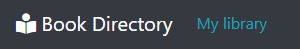
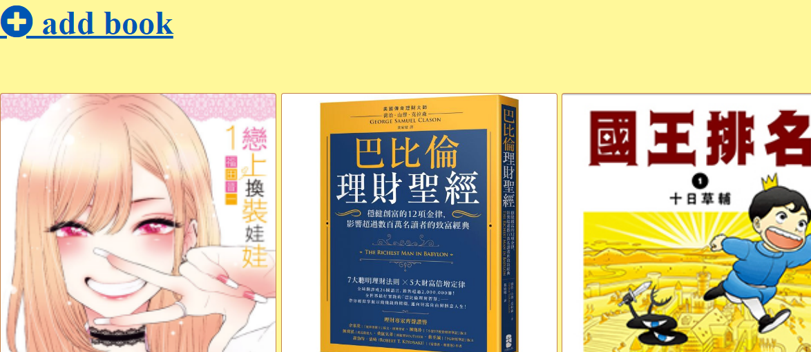
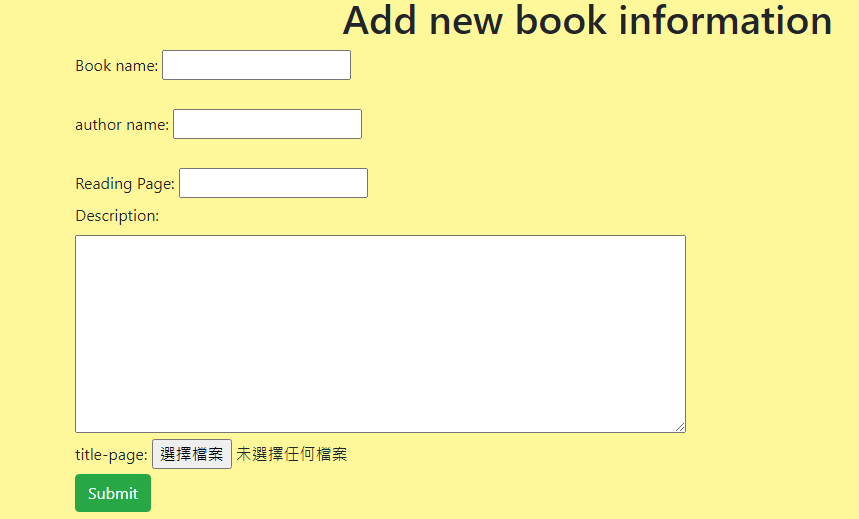
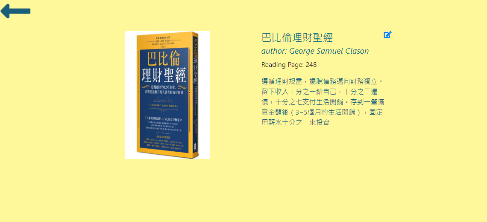
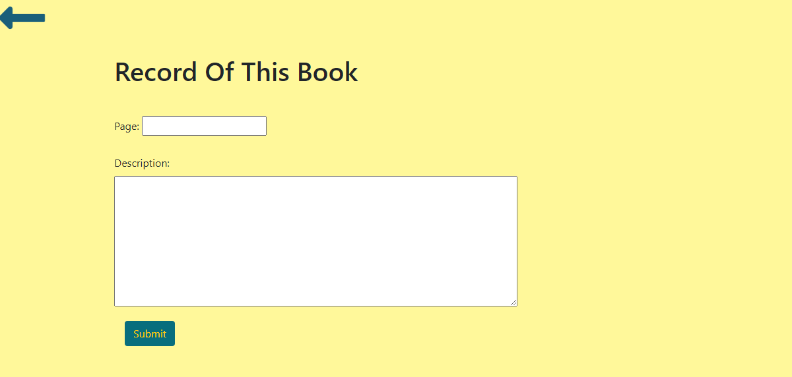
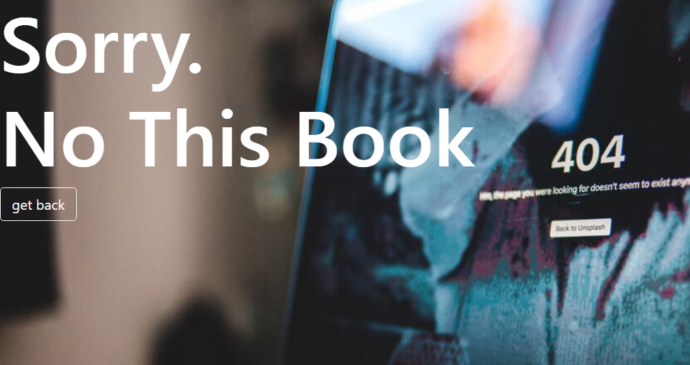

<h1>Book directory</h1>

this is a side project which I can practice my skill of Node.js. Moreover, this website is designed in RESTful style.

 

Let's see our navbar when first open the website. If you click the Book Directory, you will see the welcome message.
And at the right is My library, if you click the link it will lead you to the page which show the books that I record.

<h3>library part</h3>

on top of the page is Add book links, if you click it it will lead you to a form page which you can add new book. Moreover, below we can
see all the books that I haved record, and each of them is shown as a card. and there are learn more and delete button. If you click the learn more button it will enter the detail information about the book.
and if you click the delete the targeted card will disappear.

<h3>add book page</h3>

as you can see this is a classic form and you can record some information about the book

<h3>learn more part</h3>

as you can see, this is the detail of the targeted book if you click the learn more. Moreover, you can see a little edit icon beside the title. if you click the icon it will lead you to update the reading page and the description.

<h3>update book page and desc</h3>

with this page you can keep a bookmark and some review of the book

<h3>search on the navbar</h3>

Here I use a regex and since we use the regex it is a little bit different from the original mongoose. if there is not the matched book it will show the not found page.

<h2>Here can open the website</h2>
<a href="https://frozen-cliffs-51819.herokuapp.com/">Open the directory📕</a>
